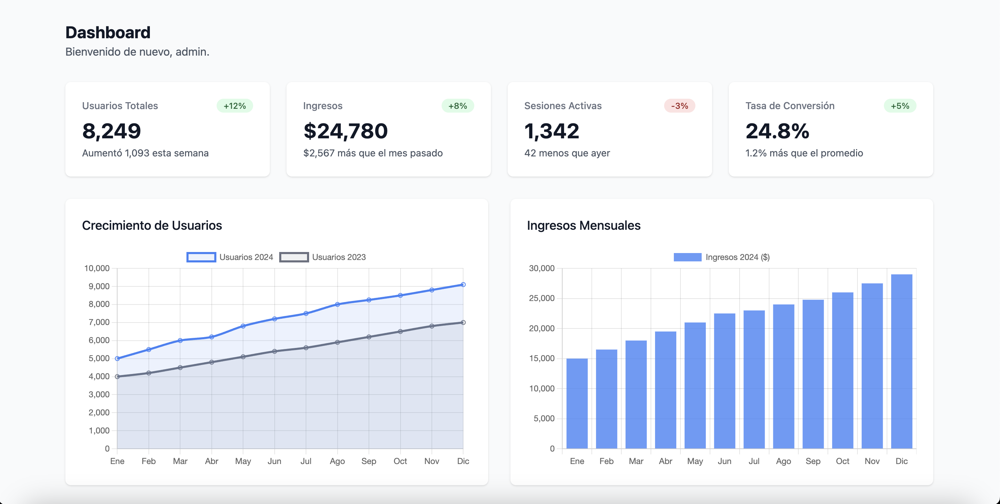

# Dashboard Clone - Tailwind CSS

Un maquetado moderno y responsivo de un dashboard administrativo construido con **Tailwind CSS** y **Chart.js**.

## 📋 Descripción

Este proyecto es un clon de dashboard que implementa una interfaz limpia y profesional para visualizar estadísticas y datos en tiempo real. Utiliza Tailwind CSS para estilos modernos y Chart.js para gráficos interactivos.

## 🎨 Vista previa



## ✨ Características

- ✅ Diseño responsivo y moderno
- ✅ Construido con Tailwind CSS (versión browser)
- ✅ Integración con Chart.js para gráficos
- ✅ Tipografía elegante con fuente Poppins
- ✅ Tarjetas de estadísticas con indicadores de cambio
- ✅ Interfaz limpia y profesional

## 📊 Componentes incluidos

- **Encabezado**: Título del dashboard y saludo personalizado
- **Tarjetas de estadísticas**: Visualización de métricas clave
  - Usuarios Totales
  - Ingresos
  - Sesiones activas
- **Indicadores de cambio**: Porcentajes de variación con código de color (verde/rojo)

## 🚀 Cómo usar

1. Abre el archivo `dashboard_clone.html` en tu navegador web
2. El archivo carga automáticamente los estilos de Tailwind CSS desde CDN
3. Chart.js también se carga desde CDN para funcionalidad de gráficos

## 📦 Dependencias

- **Tailwind CSS 4** (cargado desde CDN)
- **Chart.js** (cargado desde CDN)
- **Google Fonts** - Poppins (para tipografía)

## 💻 Tecnologías

```
HTML5 + Tailwind CSS + JavaScript (Chart.js)
```

## 📝 Estructura del proyecto

```
dashboard_tailwind/
├── dashboard_clone.html      # Archivo principal del dashboard
├── dashboard_replica.png     # Imagen de referencia del diseño
└── README.md                 # Este archivo
```

## 🎯 Propósito

Este proyecto es ideal para:
- Aprender Tailwind CSS en un contexto real
- Entender la estructura de un dashboard moderno
- Usar como base para proyectos de administración
- Referencia de buenas prácticas de diseño responsivo

---

**Nota:** Este es un maquetado estático. Para implementar funcionalidad completa, considera integrar una base de datos y un backend.
